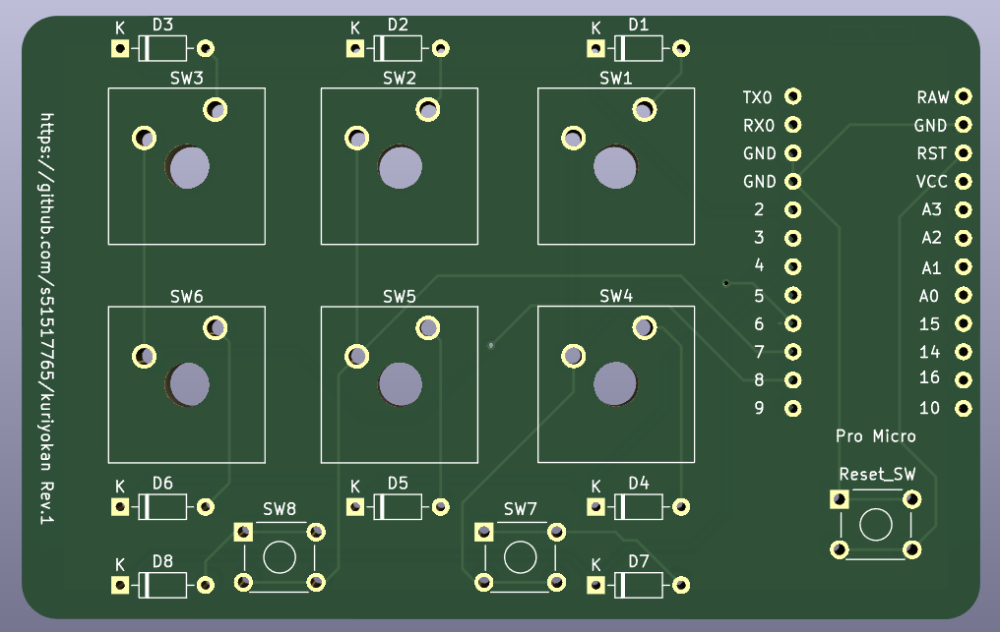
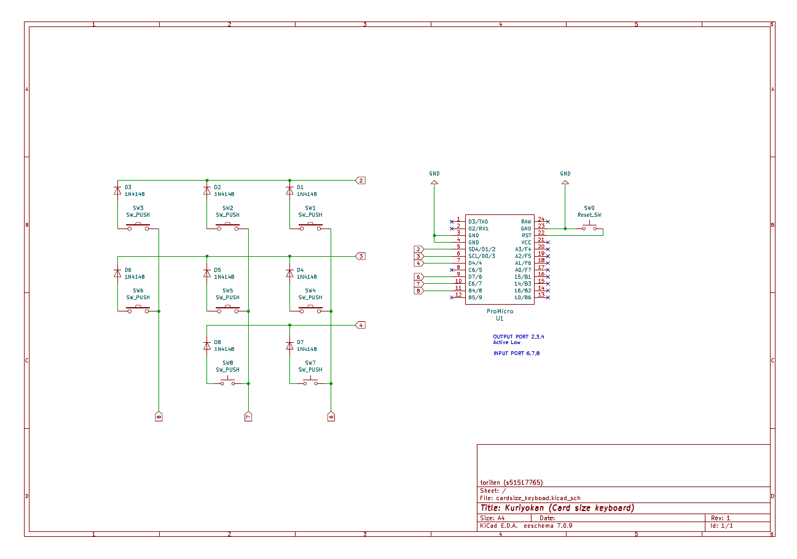

# Kuriyokan

## 概要 (Overview)

クレジットカードサイズのキーボード

## 実物イメージ (Image)

## 技術的解説 (Technical explanation)

## 部品リスト（Parts list）

| 部品               | 種類           | 数量 |
| ------------------ | -------------- | ---- |
| PCB                | -              | 1    |
| マイコン           | Pro Mocro      | 1    |
| ピンヘッダ         | 12pin          | 2    |
| キーボードスイッチ | Cherry MX 互換 | 6    |
| キーキャップ       | Cherry MX 互換 | 6    |
| タクトスイッチ     | 6mm 角         | 3    |
| ダイオード         | 1N4148         | 8    |

## ライセンス (License)

This software is released under the MIT License, see LICENSE.
